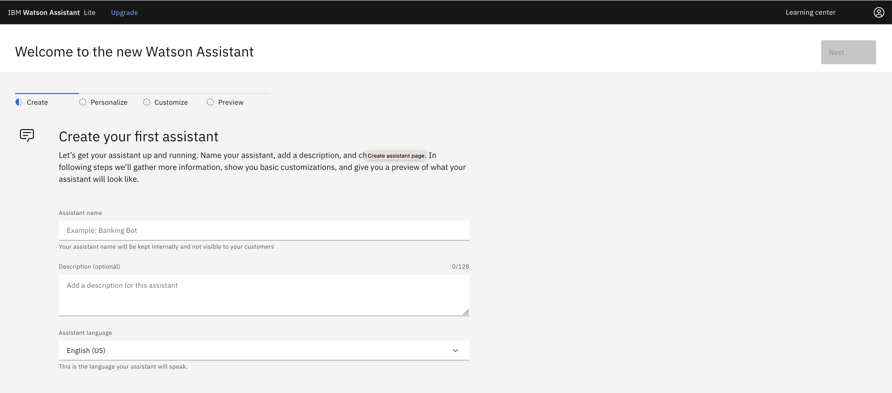
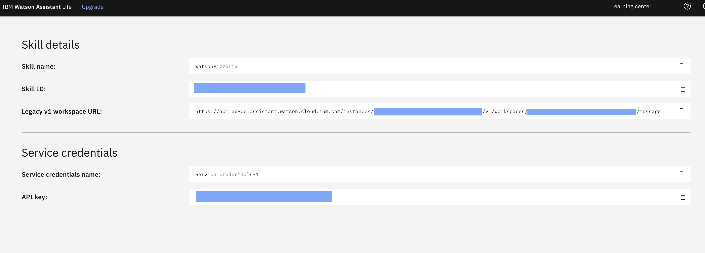
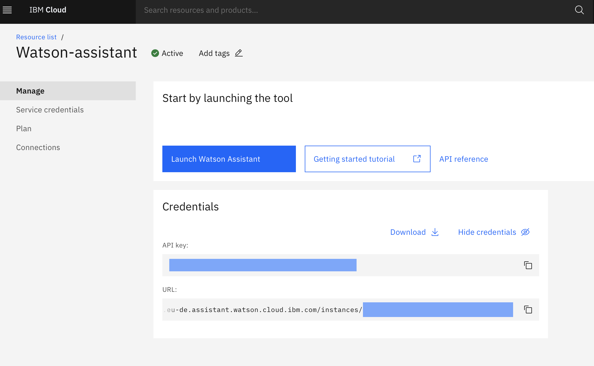

# Run locally

This document shows how to run the `watson-assistant-slots-intro` application on your local machine.

## Steps

1. [Clone the repo](#1-clone-the-repo)
2. [Create IBM Cloud service](#2-create-ibm-cloud-service)
3. [Configure Watson Assistant](#3-configure-watson-assistant)
4. [Get IBM Cloud credentials and add to .env](#4-get-ibm-cloud-services-credentials-and-add-to-env-file)
5. [Run the application](#5-run-the-application)

### 1. Clone the repo

Clone `watson-assistant-slots-intro` locally. In a terminal, run:

  `$ git clone https://github.com/Dani7B/watson-assistant-slots-intro`

We’ll be using the file [`data/watson-pizzeria.json`](../../data/watson-pizzeria.json) to upload
the Assistant Intents, Entities, and Dialog Nodes.

### 2. Create IBM Cloud service

Create the following service and name it `wasi-assistant-service`:

* [**Watson Assistant**](https://cloud.ibm.com/catalog/services/watson-assistant) - You can choose the Lite free plan

### 3. Configure Watson Assistant

#### Import the Assistant workspace.json (aka watson-pizzeria.json):

* Find the Assistant service in your IBM Cloud Dashboard.
* Click on the `Manage` tab and copy the `Url` parameter under Credentials (you are going to need it later), then click on `Launch Watson Assistant`.

After the creation, you can launch the service and you'll be redirected to the homepage, which displays by feature the new experience UI. For the scope of this project we decided to use the classic experience.
This is the new experience homepage you'll be shown.


* Click on the   on the upper right corner to open the menu
* Then choose `Switch to classic experience` and follow the wizard to be redirected to the classic experience UI.
* Go to the `Skills` tab on the left (hover on the second icon in the list and you should see the Skills label appear).
* Click `Create skill`
* Select the `Dialog skill` option and then click `Next`.
* Click the `Upload skill` tab.
* Click `Drag and drop file here or click to select a file`, go to your cloned repo directory, select the file in [`data/watson-pizzeria.json`](../../data/watson-pizzeria.json).
* Select `Upload`.

</p>

To find the `WORKSPACE_ID` for Watson Assistant:

* Go back to the `Skills` tab.
* Find the card for the workspace you would like to use. Look for `WatsonPizzeria`.
* Click on the three dots in the upper right-hand corner of the card and select `View API Details`.
* Copy the `Workspace ID` GUID.



* In the next step, you will put this `Skill ID` into the `.env` file as `WORKSPACE_ID`.

### 4. Get IBM Cloud services credentials and add to .env file

* Move the `watson-assistant-slots-intro/env.sample` file to `watson-assistant-slots-intro/.env`.

* Put the `Skill ID` into the `.env` file as `WORKSPACE_ID`.

```bash
WORKSPACE_ID=<put skill id here>
```
<p>

* Use the `apikey` and `url` from your Watson Assistant service credentials in the `.env` file. If you didn't copy the `Url` from the Watson Assistant launch page, go to the Skill details page (where you got the Skill ID and API Key). There you will find the `Legacy v1 workspace URL`: the URL you are going to need is a substring of the `Legacy v1 workspace URL`, from start to `/v1/workspaces/...` excluded.



```bash
# If Assistant service is hosted on IBM Cloud, uncomment and use these variables for IAM Authentication
CONVERSATION_APIKEY=<put assistant IAM apikey here>
CONVERSATION_URL=<put assistant url here>
```

</p>

### 5. Run the application

```bash
npm install
npm start
```

The application will be available in your browser at http://localhost:3000
